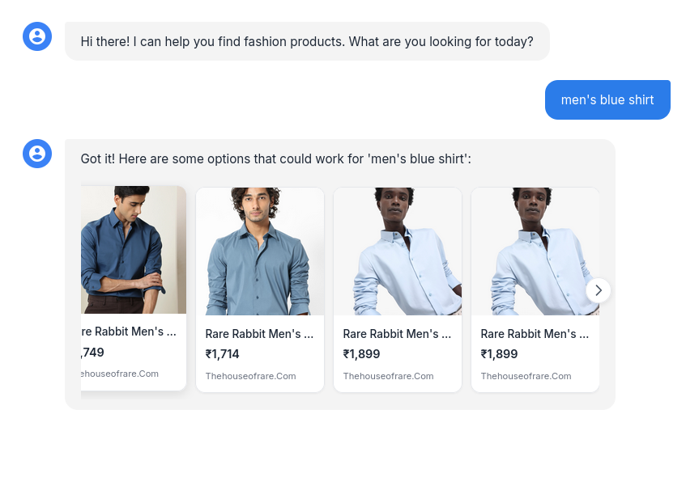
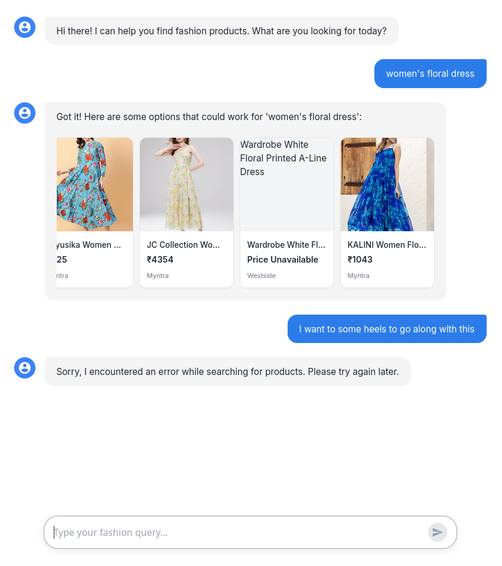
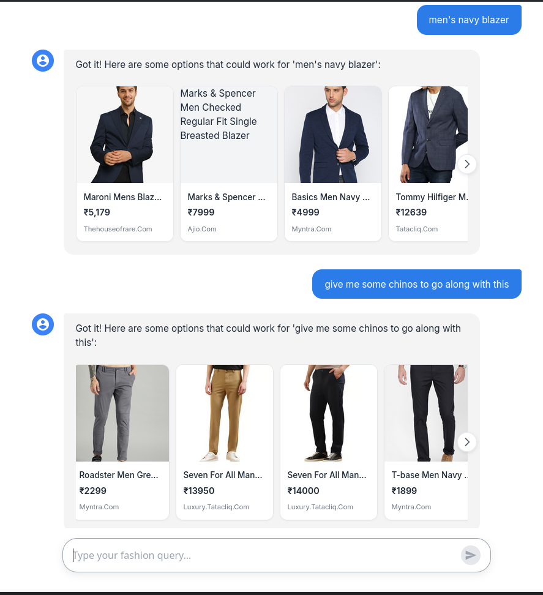

# Fashion Search: Naive vs Agentic

A comparison study of simple web search vs. agentic search for fashion product recommendations. Built as part of an AAI course project.

## Overview

This project evaluates two approaches to fashion product discovery:

| Method | Approach | Status |
|--------|----------|--------|
| **Method 1** | Naive pipeline: Web Search → LLM Parsing → Web Scraping | Done |
| **Method 2** | Agentic search with memory, planning, and tool use | In Progress |

The UI is a conversational chat interface where users type natural language fashion queries and receive product cards with images, prices, and store links from Indian e-commerce stores.

## Method 1: Naive Search Pipeline

The naive approach chains three components in a fixed linear pipeline:

```
User Query
    │
    ▼
Tavily Web Search (Indian fashion stores, max 20 results)
    │
    ▼
Gemini 2.5 Flash (extract structured product JSON from snippets)
    │
    ▼
BeautifulSoup Scraper (fetch actual image + price from each product URL)
    │
    ▼
Product Cards in Chat UI
```

### Search Scope

Restricted to 10 Indian fashion stores:
- Myntra, Ajio, TataCliq, Snitch, The House of Rare, Bewakoof, Westside, Pantaloons, Marks & Spencer India, Jaypore

### Image Extraction Strategy

The scraper uses a priority-based approach per product URL:
1. JSON-LD schema (`@type: Product`) — most reliable
2. Meta tags (`og:image`, `product:image`)
3. `` tags with keywords like `product`, `assets`, `images` in URL
4. Open Graph fallback

### Example Outputs

**Query: "men's blue shirt"**



**Query: "women's floral dress"**



**Query: "men's navy blazer and chinos"**



### Known Limitations of Method 1

- No conversation memory — follow-up queries are treated independently
- Occasional duplicate products from the same store
- LLM parsing can miss products when snippets are low-quality
- Web scraping has a 3s timeout, so slow store pages may return missing prices/images
- No style coherence across multi-item queries (e.g., "outfit for X occasion")

---

## Project Structure

```
.
├── main.py               # FastAPI server with /api/chat endpoint
├── naive_search.py       # Method 1 implementation
├── static/
│   ├── index.html        # Chat UI
│   ├── script.js         # Frontend logic (carousel, message rendering)
│   └── styles.css        # Styling
├── examples/
│   └── method-1/         # Screenshots of Method 1 outputs
├── tests/                # API and scraping test scripts
└── pyproject.toml        # Python dependencies
```

---

## Setup

### Prerequisites

- Python 3.13+
- A [Tavily API key](https://tavily.com/)
- A [Google Gemini API key](https://aistudio.google.com/)

### Install

```bash
git clone <repo-url>
cd AAI
python -m venv .venv
source .venv/bin/activate
pip install -e .
```

### Configure

Create a `.env` file in the project root:

```env
TAVILY_API_KEY=your_tavily_key_here
GEMINI_API_KEY=your_gemini_key_here
```

### Run

```bash
uvicorn main:app --reload
```

Open `http://localhost:8000` in your browser.

---

## Tech Stack

| Component | Technology |
|-----------|------------|
| Backend | FastAPI + Python 3.13 |
| Web Search | Tavily API |
| LLM Parsing | Google Gemini 2.5 Flash |
| Web Scraping | BeautifulSoup4 + lxml + requests |
| Frontend | Vanilla JS, HTML, CSS |

---

## Roadmap

- [x] Method 1: Naive pipeline (Tavily → Gemini → scrape)
- [x] Chat UI with product carousel
- [ ] Method 2: Agentic search with tool use and memory
- [ ] Evaluation metrics comparing Method 1 vs Method 2
- [ ] Side-by-side comparison interface
